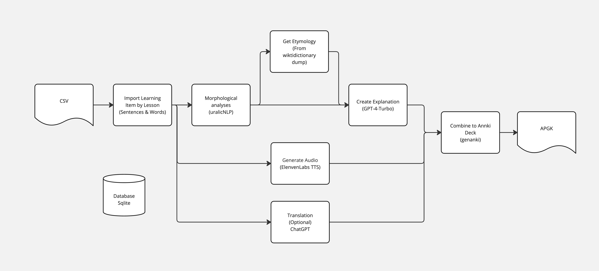

# anki-gen-fin

## Introduction
anki-gen-fin is a tool to turn a list of sentences & words from a csv to an [Anki](https://apps.ankiweb.net/) deck with explanations and voice. The explanation is generated by [GPT](https://openai.com/chatgpt) (you need a API-key). To reduce the halucinations to a minimum, GPT is provided with a analysis from uralicNLP and etymology from [english wiktionary](https://en.wiktionary.org/wiki/Wiktionary:Main_Page).
Voice is generated using [Eleven Labs](https://elevenlabs.io/) (you need a API-key).

I created this tool to learn finnish as a nativ german speaker. But it may be used to learn other languages supported by uralicNLP. If you want to try it with other languages see [Customising](#Customising).

Here you can find a deck created with this project: 

## Features
- Generates Anki decks from a provided CSV file of sentences and words.
- Analyzes language data using uralicNLP to prevent GPT halucinations.
- Creates explanation texts with the context considered, powered by GPT.
- Generates audio for pronunciation practice using Eleven Labs.
- Supports Docker and Python environments for easy setup and use.

## Use with docker

1. **Environment Setup:** 
   - Create a `.env` file based on the provided `.env_template`, including your `OPENAI_API_KEY` and `ELEVEN_LABS_API_KEY`.
   - Create a folder for the `input`, `output` & `media` files
   - Get the `config.yml` from this repo.
2. You now should have the following files:
   ```
   ROOT -|
         |- .env
         |- config.ym
         |- input\
         |- output\
         |- media\
   ```
3. **Run with Docker:**
   - Run the following command to generate an Anki deck using the docker container [w3p706/anki-gen-fin](https://hub.docker.com/repository/docker/w3p706/anki-gen-fin/general):
     ```
     docker run  --rm \
               --env-file ./.env \
               -v $(pwd)/config.yml:/app/config.yml  \
               -v $(pwd)/input:/app/input  \
               -v $(pwd)/output:/app/output  \
               -v $(pwd)/media:/app/media  \
               w3p706/anki-gen-fin \
               python3 process.py process test.csv
     ```
     This will turn the file under `input\test.csv` into an Anki deck `output\test.apkg`
     All commands are described in [Commandline API](#Commandline-API)
     See [Building the Docker container](#Building-the-Docker-container) for how to build the container

## Use with Python

You can run this directly with Python. For a debian system you can use the following steps:

1. **Clone this Repository & install Python packages with pip**:
    ```bash
    git clone https://github.com/w3p706/anki-gen-fin.git
    python -m pip install -r requirements.txt
    ```
    _If you get compiler error, you have a architecture not built a wheel for by pyhfst. armhf for example_

3. **Adding Apertium's nightly repository and installing cg3**:
    For the disambiguation to work you will have install cg3. The following is an extract from this blog post: [VISL CG-3](https://mikalikes.men/how-to-install-visl-cg3-on-mac-windows-and-linux/)
    ```bash
    curl https://apertium.projectjj.com/apt/apertium-packaging.public.gpg > /etc/apt/trusted.gpg.d/apertium.gpg
    curl https://apertium.projectjj.com/apt/apertium.pref > /etc/apt/preferences.d/apertium.pref
    echo "deb http://apertium.projectjj.com/apt/nightly bookworm main" > /etc/apt/sources.list.d/apertium.list
    apt-get update && apt-get install cg3
    cg3 --version
    ```

4. **Upgrading `pyhfst` and downloading UralicNLP models for Finnish and English**:
   See [here](https://github.com/mikahama/uralicNLP?tab=readme-ov-file#faster-analysis-and-generation) and [here](https://github.com/mikahama/uralicNLP?tab=readme-ov-file#download-models)
    ```bash
    pip install --upgrade --force-reinstall pyhfst --no-cache-dir
    python -m uralicNLP.download --languages fin eng
    ```
1. **Environment Setup:**
   - Create a `.env` file based on the provided `.env_template`, including your `OPENAI_API_KEY` and `ELEVEN_LABS_API_KEY`.

1. **Create the database:**
   This will download a 3GB jsonline document with all wiki dictionary entries from [kaikki.org](https://kaikki.org/) in finnish and extracts the etymology. It also imports other static data from `ankigenfin/base_data`:
   ```bash
   python data_tools.py generate-seed-db
   ```
   _The process will not generate explanations from the words in `ankigenfin/base_data/skip_list.txt`. Use this to exclude easy words._

1. **Create your first Deck:**
   ```bash
   python3 process.py process test.csv
   ```
   This will turn the file under `input\test.csv` into an Anki deck `output\test.apkg`
   All commands are described in [Commandline API](#Commandline-API)

## Commandline API

General syntax for running a command:

```
python process.py <command> [options]
```
### Commands
- **`process <inputfile.csv>`**: Import a CSV file, process it, and export it as an APKG file.
- **`import <inputfile.csv>`**: Import a deck from a CSV file without processing any steps.
- **`analyze <deckname>`**: Runs the linguistic analisys on a deck's content.
- **`explain <deckname>`**: Generate explanations for items in a deck with GPT.
- **`audio <deckname>`**: Generate audio for items in a deck.
- **`translate <deckname>`**: (optional) Translate items in a deck with GPT or DeepL.
- **`export <deckname> <outfile>`**: Generates Html Notes and exports a deck as an APKG file to the output folder.

## Input CSV Format

The csv should have four columns: `item, translation, sides, deck`, where `sides` can be 'Single' or 'Double' for different types of note generation.

| item                              | translation                    | sides  | deck         |
|-----------------------------------|--------------------------------|--------|--------------|
| Kahvi pullan kera on pullakahvit. | Coffee with bun is bun-coffee. | Single | Folder::Deck |
| yöpuku                            | "pajamas, nightdress"          | Double | Folder::Deck |


## Customising

The process can be customized. See the `config.yml` for:
- Language, target & translated
   - Note: What is currently not in the config is the dictionary from [kaikki.org](https://kaikki.org/) that should be used for etymology. This can be found in `ankigenfin/generate_seed_db.py` and will be used when you build the seed database 
- All GPT prompts
- The voices used to speak the text.
- The templates from the folder `anki-card-template` used for the Anki card. 
- Skip List: there is a table `skiplist` in the database. The data will be imported from `ankigenfin/base_data/skip_list.txt` when you create the container. Use this to exclude easy words. Words in this table will be omited when generating an explanation with GTP.

## Building the Docker container

1. Use docker to build the seed database
   ```bash
   docker buildx build --platform=linux/amd64 --target seed_db --output type=local,dest=output .
   mv output/seed.sqlite3 .
   ```
   This will create the a database, with only the static data, downloading the 3GB Wikidictionary data from kaikki.org

2. Build docker image
   ```bash
   docker buildx build --platform=linux/amd64 -t w3p706/anki-gen-fin:latest --target container .
   ```

## The Process
If you value pictures, here is one of the process this repository implements:



## Contribution Guidelines:
Contributions via pull requests are highly welcomed. 

## Acknowledgments:
This project utilizes several open-source tools and libraries, including uralicNLP, genanki, and numerous others. Special thanks to the developers and contributors of these resources, as well as services provided by OpenAI GPT, Eleven Labs, and DeepL.
 
